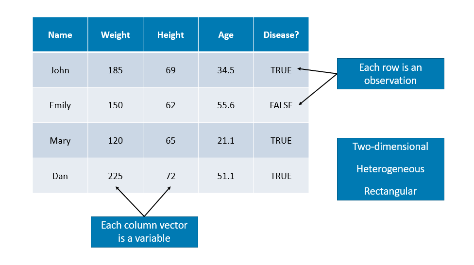
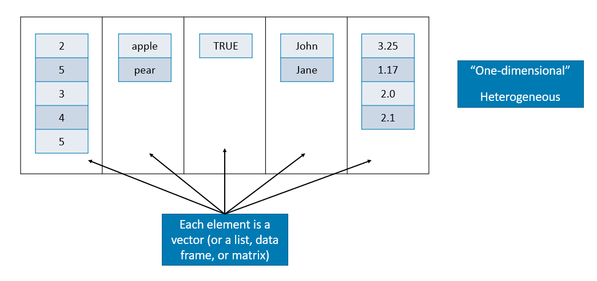

# Other R Objects

This chapter introduces other types of R objects: matrix, data frame, list, and array.

## Matrices

R stores matrices (and arrays) in a similar way as vectors, but with the attribute called dimension. A matrix is an array that has two dimensions. Data in a matrix are organized into rows and columns. Matrices are commonly used while arrays are rare.  We will not see arrays in this book in detail. Matrices are **homogeneous** data structures, just like atomic vectors, but they can have 2 dimensions, rows and columns, unlike vectors.  

Matrices can be created using the **matrix** function.  In the `matrix()` function, after the data vector, `nrow` and `ncol` specify the desired numbers of rows and columns of the matrix.

```{r}
#Let's create 5 x 4 numeric matrix containing numbers from 1 to 20
mymatrix <- matrix(1:20, nrow = 5, ncol = 4)  #Here we order the number by columns
mymatrix

class(mymatrix)
dim(mymatrix)
```

Notice that the matrix is created by filling in the columns. If you want to fill the rows instead of columns, you can add the argument `byrow = TRUE`.

```{r}
mymatrix <- matrix(1:20, nrow = 5, ncol = 4, byrow = TRUE)
mymatrix
```

We will be using two different variables. Following the usual mathematical convention, lower-case `x` (or any other letter), which stores a vector and capital `X`, which stores a matrix. Don't forget: we can do this because R is case sensitive.  

If the length of the supplied vector is not equal to the number of rows multiplied by the number of columns, R will use the recycling rule on the vector to fill in the matrix, which is usefull:

```{r}
matrix(6, 3, 3)
```

After defining a matrix, we can apply various functions on it.

```{r}
x <- matrix(1:12, nrow = 4)

dim(x)            #the dimension of a matrix         

nrow(x)           #the number of row of a matrix 

ncol(x)           #the number of column of a matrix 
```

### Matrix Operations

Now some key matrix operations:  

```{r}

X <- matrix(1:9, nrow = 3, ncol = 3)
Y <- matrix(11:19, nrow = 3, ncol = 3)

A <- X + Y
A

B <- X * Y
B

#The symbol %*% is called pipe operator.
#And it carries out a matrix multiplication
#different than a simple multiplication.

C <- X%*%Y  
C
```

Note that `X * Y` is not a matrix multiplication. It is element by element multiplication. (Same for `X / Y`). Instead, matrix multiplication uses `%*%`. Other matrix functions include `t()` which gives the transpose of a matrix and `solve()` which returns the inverse of a square matrix if it is invertible.  

Here are some operations very useful when using matrices:  

```{r}
rowMeans(A)
colMeans(B)
rowSums(B)
colSums(A)
```

Last thing: When vectors are coerced to become matrices, they are column vectors. So a vector of length n becomes an $n \times 1$ matrix after coercion.  

```{r}
x <- 1:5
X <- as.matrix(x)
X
```

### Combine vectors or matrices into a matrix

The `matrix()` function is not the only way to create a matrix. Matrices can also be created by combining vectors as columns, using `cbind()`, or combining vectors as rows, using `rbind()`.  Look at this:  

```{r}
#Let's create 2 vectors.
x <- rev(c(1:9))  #this can be done by c(9:1). I wanted to show rev()
x

y <- rep(2, 9)
y

A <- rbind(x, y)
A

B <- cbind(x, y)
B

#You can label each column and row
colnames(B) <- c("column1", "column2")
B
```

Also we can append or merge several matrices

```{r}
m1 <- matrix(1:6, 2, 3)
m1
m2 <- matrix(5:10, 2, 3)
m2

rbind(m1, m2) # Append
cbind(m1, m2) # Merge
```

### Subsetting Matrix

Like vectors, matrices can be subsetted using square brackets, `[ ]`. However, since matrices are two-dimensional, we need to specify both row and column indices when subsetting.  

```{r}
Y
Y[1,3]
Y[,3]
Y[2,]
Y[2, c(1, 3)] # If we need more than a column (row), we use c()
```
```{r}
rownames(Y) <- c("a","b","c")
colnames(Y) <- c("x","y","z")
Yn <- Y[, c(1, 3)]
Yn
```

If you need to keep the result as a matrix, you can add a third dimension drop = FALSE in the subsetting operation.

Conditional subsetting is the same as before in vectors.  Let's solve this problem:  what's the number in column 1 in `Y` when the number in column 3 is 18?  

```{r}
Y
Y[Y[,3]==18, 1]

#What are the numbers in a row when the number in column 3 is 18?
Y[Y[,3]==19, ]

#Print the rows in Y when the number in column 3 is more than 17?
Y[Y[,3] > 17, ]
```

We will see later how these conditional subsetting can be done much smoother with data frames.  

### `apply()` function  

We will see the `apply` family later in more detail.  The `apply()` function is very handy for matrices if we may want to apply certain function on each row or column. It takes three arguments by default. The first argument is the object, the second argument is the dimension(s) to apply the function on, and the third argument is the function.

```{r}
apply(Y, 2, mean)
apply(Y, 1, mean)
apply(Y, 2, sum)
apply(Y, 2, sd)
apply(Y, 2, function(g) g^2)
```
## Data Frames

We have seen vectors and matrices for storing data. We will now introduce a data frame that is the most common way to store and interact with data.  Data sets for statistical analysis are typically stored in data frames in R. Unlike a matrix, **a data frame can have different data types for each elements (columns)**. A data frame is a list of vectors (columns - you can think of them as "variables"). So, each vector (column) must contain the same data type, but the different vectors (columns) can store different data types.  

**However, unlike a list, the columns (elements) of a data frame must all be vectors and have the same length (number of observations)**  

```{r, echo=FALSE}

```  

Data frames combine the features of matrices and lists.  

Like matrices, data frames are **rectangular**, where the columns are variables and the rows are observations of those variables. like lists, data frames can have elements (column vectors) of **different data types** (some double, some character, etc.) – but they **must be equal length**. Real data sets usually combine variables of different types, so data frames are well suited for storage.   

```{r, warning=FALSE, message=FALSE}
#One way to do that
mydata <- data.frame(diabetic = c(TRUE, FALSE, TRUE, FALSE), 
                     height = c(65, 69, 71, 73))
mydata
str(mydata)
dim(mydata)

#Or create vectors for each column
diabetic = c(TRUE, FALSE, TRUE, FALSE)
height = c(65, 69, 71, 73)

#And include them in a data frame as follows
mydata <- data.frame(diabetic, height)
mydata
str(mydata)
dim(mydata)

#And more importantly, you can extend it by adding more columns
weight = c(103, 45, 98.4, 70.5)
mydata <- data.frame(mydata, weight)
mydata
```

You will have the following mistake a lot.  Let's see it now so you can avoid it later.  

```{r, warning=FALSE, message=FALSE}

#Try running the code below separately without the comment # and see what happens

#mydata <- data.frame(diabetic = c(TRUE, FALSE, TRUE, FALSE, FALSE), 
                     #height = c(65, 69, 71, 73))

```

The problem in the example above is that there are a different number of rows and columns. Here are some useful tools for diagnosing this problem:  

```{r, warning=FALSE, message=FALSE}
#Number of columns
ncol(mydata)
nrow(mydata)
```

Often data you’re working with has abstract column names, such as (x1, x2, x3…).The `cars` is data from the 1920s on “Speed and Stopping Distances of Cars”. There is only 2 columns shown below.  

```{r, warning=FALSE, message=FALSE}
colnames(datasets::cars)

#Using Base r:
colnames(cars)[1:2] <- c("Speed (mph)", "Stopping Distance (ft)")
colnames(cars)

#Using GREP:
colnames(cars)[grep("dist", colnames(cars))] <- "Stopping Distance (ft)"
colnames(cars)
```

Using `summary()` on a data frame, you get the summary statistics for each variable.

```{r}
summary(cars)
```
### Subsetting Data Frames

Subsetting data frames can work much like subsetting matrices using square brackets, `[,]`. Let's use another data given in the `ggplot2` library.    

```{r, warning=FALSE, message=FALSE}
library(ggplot2)
head(mpg, n = 10)
```

And we need to see the cars with highway mpg over 35: 

```{r, warning=FALSE, message=FALSE}
mpg[mpg$hwy > 35, c("manufacturer", "model", "year")]
```

An alternative would be to use the `subset()` function, which has a much more readable syntax.  

```{r, warning=FALSE, message=FALSE}
subset(mpg, subset = hwy > 35, select = c("manufacturer", "model", "year"))
```

Lastly, we could use the filter and select functions from the `dplyr` package which introduces the `%>%` operator from the `magrittr` package. This is not necessary for this book, however the `dplyr` package is something you should be aware of as it is becoming a popular tool in the R world.  

```{r, warning=FALSE, message=FALSE}
library(dplyr)
mpg %>% filter(hwy > 35) %>% select(manufacturer, model, year)
```

We will see `dplyr` later.

### Tibble

Tibbles are data frames, but change some behaviors of data frames to make coding easier. To use the tibble class, you need to install the tibble package, which is part of the `tidyverse` package.

```{r}
library(tibble)
animal <- rep(c("sheep", "pig"), c(3,3))
year <- rep(2019:2021, 2)
healthy <- c(rep(TRUE, 5), FALSE)
my_tibble <- tibble(animal, year, healthy)
my_tibble
```

You can convert a tibble to a data frame or data frame to tibble.

```{r}
my_data_frame <- data.frame(animal, year,  healthy)
tt <- as_tibble(my_data_frame)
tt

# Or

bck <- as.data.frame(tt)
bck
```

In some aspects tibbles are useful, data frames are more common.

### Plotting from data frame

There are many good ways and packages for plotting.  I'll show you one here.  Visualizing the relationship between multiple variables can get messy very quickly. Here is the `ggpairs()` function in the **GGally** package [@Tay_2019].

```{r, warning=FALSE, message=FALSE}
library(fueleconomy)  #install.packages("fueleconomy")
data(vehicles)
df <- vehicles[1:100, ]
str(df)
```

Let's see how `GGally::ggpairs()` visualizes relationships between quantitative variables:
  
```{r, warning=FALSE, message=FALSE}
library(GGally) #install.packages("GGally")
new_df <- df[, c("cyl", "hwy", "cty")]
ggpairs(new_df)
```

The visualization changes a little when we have a mix of quantitative and categorical variables. Below, fuel is a categorical variable while hwy is a quantitative variable.  

```{r, warning=FALSE, message=FALSE}
mixed_df <- df[, c("fuel", "hwy")]
ggpairs(mixed_df)
```

## Lists
A list is a one-dimensional heterogeneous data structure. So it is indexed like a vector with a single integer value, but each element can contain an element of any type.

```{r, echo=FALSE}

```  

Lets look at some examples of working with them:

```{r, warning=FALSE, message=FALSE}
# creation
A <- list(42, "Hello", TRUE)
dim(A)
str(A)
class(A)

# Another one
B <- list(
          a = c(1, 2, 3, 4),
          b = TRUE,
          c = "Hello!",
          d = function(arg = 1) {print("Hello World!")},
          X = matrix(0, 4 , 4)
)

B
dim(B)
dim(B$X)
str(B)
class(B)
```

Lists can be subset using two types of syntax, the `$` operator, and square brackets `[ ]`. The `$` operator returns a named element of a list. The `[ ]` syntax returns a list, while the `[[ ]]` returns an element of a list.  

```{r, warning=FALSE, message=FALSE}
#For example to get the matrix in our list
B$X
#or
B[5]
#or
B[[5]]
#And to get the (1,3) element of matrix X in list B
B[[5]][1,3]
```

What's the difference between the results of `B[[5]]` and `B[5]`? The former is the third element of my_list which is a matrix, while the latter is a list containing a single matrix element. Let’s confirm this by looking at their structures.

```{r}
str(B[[5]])

str(B[5])
```

## Array

Array can be viewed as an extension of vector and matrix to a higher dimensional space, and still **only contains elements of the same type**.

```{r}
A <- array(1:24, c(2,3,4))
A

dim(A)
```

The first argument is the data input (`1:241`).  The second argument is the dimension of the array: `2` is the number of rows, `3` is the number of columns, and `4` is how many matrices we will have.  Here is an example with a higher dimension:  

```{r}
y <- array(0, c(2,3,4,5))
y
dim(y)
```

```{r}
A[1, 2, 3]     #the 3rd matrix with [1,2]

A[, , 2]       #the 2nd matrix

A[2, , 4]      #the 4th matrix, 2nd row
A[-2, 3, -3]   #Expect the 3rd matrix, get the 3rd columns without the 2nd rows
```

```{r}
apply(A, 1, mean)      #calculate the mean all rows (we have 2 rows)

# Verify them
mean(A[1, , ])         #mean of all 1st rows
mean(A[2, , ])         #mean of all 2nd rows

apply(A, 2, sum)       #calculate the sum of all columns

apply(A, 3, sd)        #calculate the sd each matrix
```

