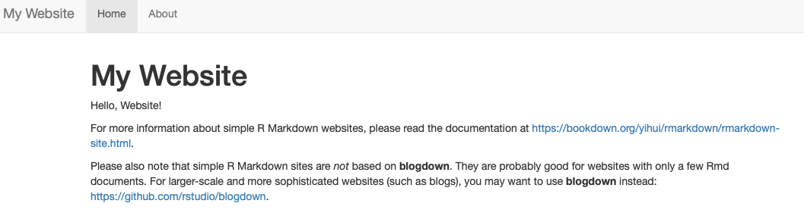

# Exploratory Data Analysis (EDA)

EDA is an informal process to have an inital investigation of the data.  EDA is an important part of any data analysis.  For example, data cleaning is just one application of EDA: you ask questions about whether your data meets your expectations or not. To do data cleaning, you’ll need to deploy all the tools of EDA: **visualisation, transformation, and modelling**.

The main steps in exploratory data analysis are:

- Getting the data
- Dataset Overview
- Visualization
- Identifying missing values
- Distibution of data: variations
- Correlated variables

## Getting the data

We will use the same data set, Ames Housing Price data from the `AmesHousing` package, containing 2930 observations and 81 features including the sale date and price.

```{r }
library(AmesHousing)
library(dplyr)
library(DataExplorer)
amesdata <- make_ames()
introduce(amesdata)
```
```{r}
glimpse(amesdata)
```
## Visualization

### Looking into
  
```{r}
amesdata %>% plot_intro()
amesdata %>% plot_missing()
```
Yes, our data is "clean" but how about this:

```{r}
library(forcats)
gss_cat %>% glimpse()
gss_cat %>% plot_missing()
gss_cat %>% profile_missing()
```

See the data source here: <https://forcats.tidyverse.org/reference/gss_cat.html>

### Plots

```{r}
amesdata  %>% plot_density()
```

```{r}
gss_cat  %>% plot_correlation()
```
## Variation & Correlation

The “near-zero-variance” predictors may need to be identified and eliminated prior to modeling.  We use the package `caret` to identify ["near-zero-variance" variables](https://topepo.github.io/caret/pre-processing.html):

> To identify these types of predictors, the following two metrics can be calculated:

> the frequency of the most prevalent value over the second most frequent value (called the “frequency ratio’’), which would be near one for well-behaved predictors and very large for highly-unbalanced data and
> the “percent of unique values’’ is the number of unique values divided by the total number of samples (times 100) that approaches zero as the granularity of the data increases

> If the frequency ratio is greater than a pre-specified threshold and the unique value percentage is less than a threshold, we might consider a predictor to be near zero-variance.

```{r}
caret::nearZeroVar(amesdata, saveMetrics= TRUE)
```
  
Again, using the package `caret`:

>While there are some models that thrive on correlated predictors (such as pls), other models may benefit from reducing the level of correlation between the predictors.

>Given a correlation matrix, the `findCorrelation` function uses the following algorithm to flag predictors for removal:

```{r}
#descrCor <-  cor(gss_cat)
#highCorr <- sum(abs(descrCor[upper.tri(descrCor)]) > .999)
```

## RMarkdown

R Markdown provides an excellent platform for authoring your data science projects (like EDA's) combining your codes, their results, and your commentary. R Markdown documents support multiple output formats: HTML, PDFs, Word files, slideshows, and more.

Here are some examples

- html output: <https://raw.githack.com/yaydede/Blog_posts/main/EDA.html>
- pdf output: <https://yaydede.github.io/files/CV6.pdf> 

You can use R Markdown in many ways but here are the few main ways:

- For communicating to decision makers who want to focus on the conclusions, not the code behind the analysis.
- For collaborating with those, who are interested in both your conclusions and the codes. 
- As a nice notebook where you can capture not only what you did, but also what you were thinking.
- As a scientific manuscript using Latex: <https://www.marianamontes.me/post/academic-writing-in-r-markdown-i/>
- A book with [Bookdown](https://bookdown.org): <https://yaydede.github.io/ToolShed/>
- As a blog with [Blogdown](https://bookdown.org/yihui/blogdown/): <https://shilaan.rbind.io/post/building-your-website-using-r-blogdown/>
- As a good `html` support for your website: <https://yaydede.github.io>

Our package `RBootcamp` has a template: `Worksheet1`.  Locate it at `File > New File > R Markdown > Template`.  It will give you a good starting point

# Publishing at GitHub

You can make your work open, reproducible, shareable, and portable by using RStudio, RMarkdown, and [GitHub](https://github.com). We can use RMarkdown files in RStudio and connect them to GitHub, which is an online repository that allows anyone to view the code you have produced.

This tutorial is just for creating your own personal website that you can store your works and many other shareable documents like your resume. More details about how to use R and RStudio projects with GitHub can be found in [Happy Git with R](https://happygitwithr.com/new-github-first.html).

Here are the steps:  

1. Create a new repository on [GitHub](https://github.com) for your work:  Do not initialize the repo with a `.gitignore` or a `README` file. 
2. Copy the repository URL to your clipboard: Do this by clicking the green `Clone` or `Download` button.  Copy the HTTPS clone URL (looks like: https://github.com/{yourname}/{yourrepo}.git).
3. Create a new RStudio Project via git clone. Open RStudio:  Do this by clicking `File > New Project > Version Control> Git`.  Paste the copied URL.  Make sure that you you tell RStudio where to create this new Project. Click `Create Project`.
4. In your R console, type and run the following code: `rmarkdown:::site_skeleton(getwd())`.  This will create the shell for a basic R Markdown website and publishing this site to GitHub Pages.
5. Close RStudio and re-open your site by clicking on the project file (`.Rproj`).  Now you will see two `rmd` files: `index.Rmd`, which has the content of your site’s homepage. This file must be named `index.Rmd`; `about.Rmd`, which is a second, distinct page of your site. This file can have any name, but let keep it as `about` for now.
6. When we build your site those `rmd` files will be knitted to create `.html` versions locally. The file `_site.yml`, is just necessary for site setup.  We will have our HTML files (when we build the site) in `docs/`, which is necessary for using GitHub pages to make our pages go live.  Open `_site.yml` and add the following on its own line at the end:
  
`name: my-website`  
`output_dir: docs`
  
7. If you plan to use GitHub Pages for publishing your website, you need to tell GitHub Pages to bypass using `Jekyll` to build your site.  Add a single empty file named `.nojekyll` to your project root directory: `file.create(".nojekyll")`
8. Almost done!  In RStudio, you can render your site locally from the either the IDE or the R console: find the `Build` tab and select `Build Website`.  Or you can run from the console:  `rmarkdown::render_site()`. 
9.  Finally push all those changes to GitHub: `commit` and `push`. 

One more step will give you a website: Back on GitHub, click the `Settings` tab of your project repository.  Scroll down until you get to `Pages` and select `master branch/docs folder`.  

Now you have your own personal website with a live `url`: You can share it, tweet it, send it to your friends – it’s now live!  You can add this `url` to the repo description so that it’s easy to find.

See more details at [rstudio4edu](https://rstudio4edu.github.io/rstudio4edu-book/make-rmd.html).

```{r, echo=FALSE}

```  


