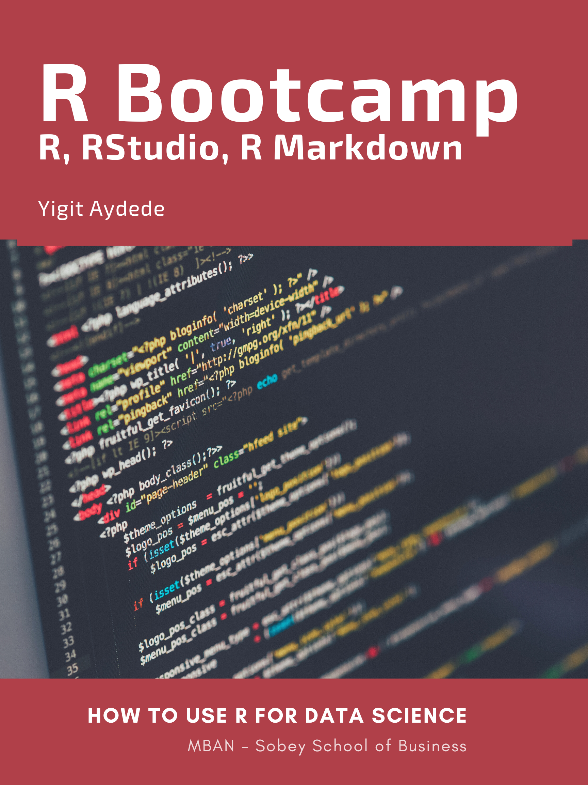

--- 
title: "R Bootcamp - How to use R for Data Science"
author: "[Yigit Aydede](https://yaydede.github.io/)"
date: "2022-10-13"
site: bookdown::bookdown_site
documentclass: book
bibliography: [book.bib, packages.bib]
url: 'https\://yaydede.github.io/Bootcamp_book/'
cover-image: /Users/yigitaydede/Dropbox/Documents/Courses/MBAN/RBootcamps/Bootcamp_book/png/cover.png
description: |
  This book is companion fro RBootcamp package.
link-citations: yes
urlcolor: cyan
---

# About {.unnumbered}

This book covers basics to learn R for Data Science. It is designed for [MBAN](https://www.smu.ca/mban/index.html) students.

We also have a companion R package named `RBootcamp`, containing the data sets used as well as interactive exercises for each part.

{width=400px height=550px}

## Why R? {.unnumbered} 

R is both a programming language and software environment for statistical computing, which is free and open-source.  

With ever increasing availability of large amounts of data, it is critical to have the ability to analyze the data and learn from it for making informed decisions. Familiarity with software such as R allows users to visualize data, run statistical tests, and apply machine learning algorithms. Even if you already know other software, there are still good reasons to learn R:

1. **R is free.** If your future employer does not already have R installed, you can always download it for free, unlike other proprietary software packages that require expensive licenses. You can always have access to R on your computer.

2. **R gives you access to cutting-edge technology.** Top researchers develop statistical learning methods in R, and new algorithms are constantly added to the list of packages you can download.

3. **R is a useful skill.** Employers that value analytics recognize R as useful and important. If for no other reason, learning R is worthwhile to help **boost your resume.**

Here is a very good article about R and Programming that everybody should read: [7 Reasons for policy professionals to get into R programming in 2019](http://gilesd-j.com/2019/01/07/7-reasons-for-policy-professionals-to-get-pumped-about-r-programming-in-2019/) [@Jones_2019].

## License {.unnumbered}

.](png/cc.png)

